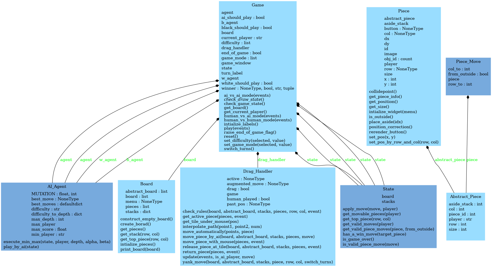
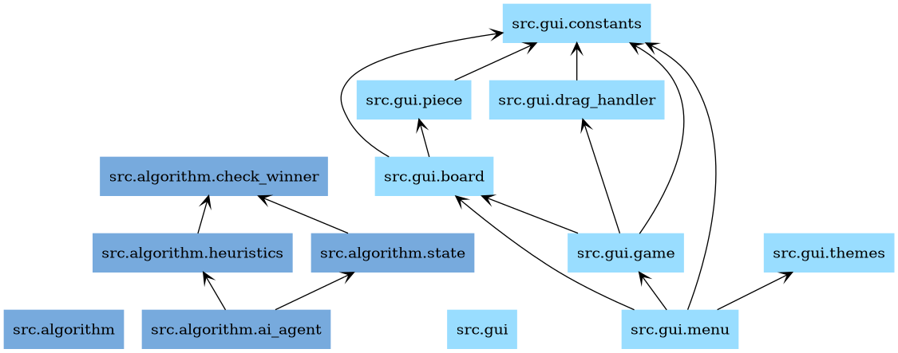

# Gobblet Game AI Player

## EXE
exe file is in game.rar 

## Usage
- clone repo 

``` sh 
git clone https://github.com/mohamedrezk122/gobblet-ai-player
cd gobblet-ai-player
```
- install dependencies 

``` sh 
pip install -r requirements.txt
```
- run game 

``` sh 
python3 main.py 
```
## Diagrams





## Development Guidelines
- File names 
    + snake_case, e.g `game_actions`, `minimax` 
    + make it short, and avoid clashing with functions/variable names 
- Variable names
    + snake_case (all small separated by underscores, and begins by a noun), e.g `game_state`
    + try to avoid single/double chars variable names, make it meaningful  
- Function/Method names 
    + snake_case (all small separated by underscores, and begins by a verb), e.g `update_game_state`
    + try to add a doc string to explain what function does 
- Class names 
    + Pascal_Snake_Case, or Title_Case , e.g `State`, `Play_Button`
- Constants 
    + ALL_CAPS, e.g `RADIUS_OF_EARTH`
    + if there is a lot of constants place them in separate file 
- Function/Method length 
    + try to limit the function size to 60 lines maximum


